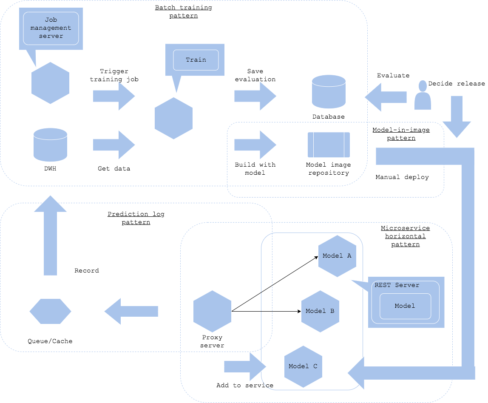

# Train-then-serve pattern

## Usecase
- 머신 러닝 모델부터 실제 운영까지 전체 워크플로우를 디자인하는 경우.
- 학습과 릴리즈를 각각 다른 워크플로우로 분리할 때. 
- 모델의 릴리즈 품질을 수동으로 평가할 때. 
- 실제 운영 환경에서 모델을 평가할 때. 

## Architecture
학습과 서빙을 연결하는 워크플로우를 설계할 때, 학습 패턴과 서빙 패턴을 조합하는 구성을 할 수 있습니다. 평가가 끝난 학습된 모델을 수동으로 릴리즈를 할 때, 여러 패턴을 조합한 train-then-serve 패턴을 사용할 수 있습니다. 이 워크플로우에서는 사람에 의한 평가가 들어가기 때문에, 자주 모델 릴리즈를 하려면 적합하지 않은 구조이지만, 모델과 시스템의 품질을 확실히 보장할 수 있습니다. 
  
 트레이닝과 서빙을 연결하기 위해 
[model load pattern](../../Operation-patterns/Model-load-pattern/design_ko.md) 이나 [model-in-image pattern](../../Operation-patterns/Model-in-image-pattern/design_ko.md) 을 사용할 수 있습니다. 이는 모델과 예측 서버 관리하는 방법에 따라 결정할 수 있습니다. 현재 서버에서 변경 없이 모델을 업데이트하려면 [model load pattern](../../Operation-patterns/Model-load-pattern/design_ko.md)을, 
전체 서버를 업데이트해야 한다면  [model-in-image pattern](../../Operation-patterns/Model-in-image-pattern/design_ko.md)을 선택할 수 있습니다. 
  
실제 운영 환경에서는 프록시 환경 변수 수정으로 운영 중인 모델의 예측 동작을 업데이트 할 수 있는 [parameter-based serving pattern](../../Operation-patterns/Parameter-based-serving-pattern/design_ko.md)이 효과적일 수도 있습니다. 서비스 관리 측면에서 [prediction log pattern](../../Operation-patterns/Prediction-log-pattern/design_ko.md)과 [prediction monitoring pattern](../../Operation-patterns/Prediction-monitoring-pattern/design_ko.md)은 반드시 사용되어야 합니다. 
 
서빙 패턴과 QA 패턴을 선택하는 것은 운영 요건에 따라 달라질 수 있지만, 결국 여러 패턴의 조합이 될 것이라 생각합니다. 아래 그림은 [web single pattern](../../Serving-patterns/Web-single-pattern/design_ko.md) 과  [online AB testing pattern](../../QA-patterns/Online-ab-test-pattern/design_ko.md)
의 조합을 표현한 다이어그램입니다. 로그들은 DWH에 기록되어 모델 개선과 재학습에 사용됩니다. 
 
학습과 서빙 단계 분리의 장점은 릴리즈 전에 모델을 평가할 수 있다는 것입니다. 만약 릴리즈 전 테스트 데이터셋 기반의 평가가 충분하지 않다 생각되거나 수동 품질 보증이 필요한 경우 이 구성을 생각해 볼 수 있습니다. 또한, 이 패턴은 학습 및 서빙을 구분함으로써 학습 파이프라인의 장애가 서빙 시스템과 릴리즈에 직접적인 영향을 끼치지 않아 서비스 가용성을 강화시켜줍니다. 하지만 모델을 실시간 혹은 자주 업데이트해야 하는 경우는 적합하지 않습니다. 

## Diagram

## Pros
- 릴리즈 전 수동 모델 평가 가능합니다.
- 워크플로우와 학습 및 릴리즈 장애로부터의 분리할 수 있습니다. 

## Cons
- 자동화가 되지 않습니다.

## Needs consideration
- 학습 패턴과, QA 패턴, 서빙 패턴 조합 방법. 
- 모델 릴리즈 기준.
- 모델 릴리즈 빈도. 
