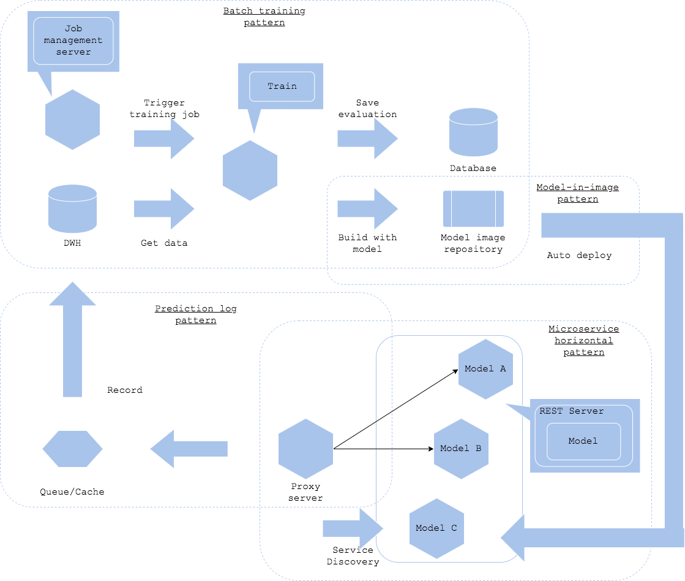

# Training-to-serving pattern

## Usecase
- 머신 러닝 모델부터 실제 운영까지 전체 워크플로우를 디자인하는 경우. 
- 학습 직후 모델을 출시할 경우.
- 모델을 실제 운영 환경까지 자동으로 배포할 경우. 
- 모델을 안정적으로 학습할 수 있을 경우.
- 모델에 자주 업데이트해야 할 경우.

## Architecture
학습과 서빙을 연결하는 워크플로우를 설계 할때, 학습 패턴과 서빙 패턴을 조합하는 구성을 할 수 있습니다. 학습 파이프라인과 함께 모델을 계속해서  배포해야 하는 경우, 이 패턴을 사용할 수 있습니다. 이 패턴으로 학습 파이프 라인을 완료되면 자동으로 릴리즈하여 모델 서버를 구축할 수 있습니다. 모델이 자주 업데이트되고 수동 평가가 어려울 경우, 적합한 패턴입니다. 
 
학습 파이프라인으로는 [batch training pattern](../../Training-patterns/Batch-training-pattern/design_ko.md) 나 [pipeline training pattern](../../Training-patterns/Pipeline-training-pattern/design_ko.md)를 선택할 수 있습니다. [parameter and architecture search pattern](../../Training-patterns/Parameter-and-architecture-search-pattern/design_ko.md) 은 학습 모델의 품질이 안정적이라고 할 수 없기 때문에 이 패턴과 적합하지 않은 경우가 많습니다. 
 
[model load pattern](../../Operation-patterns/Model-load-pattern/design_ko.md) 나 [model-in-image pattern](../../Operation-patterns/Model-in-image-pattern/design_ko.md)을 사용하여 학습과 서빙을 연결할 수 있는데, 원하는 모델과 예측 서버 관리 방법에 따라 결정할 수 있습니다. 현재 서버에서 변경없이 모델을 업데이트 하려면 [model load pattern](../../Operation-patterns/Model-load-pattern/design_ko.md)을, 
모든 서버를 업데이트 하려면  [model-in-image pattern](../../Operation-patterns/Model-in-image-pattern/design_ko.md)을 선택할 수 있습니다. 
 
서빙 할 때는 [microservice horizontal pattern](../../Serving-patterns/Microservice-horizontal-pattern/design_ko.md) 을 사용하는 것이 좋습니다. 이 패턴은 새로운 예측 서버를 다른 서버와 병렬로 배치하고, 프록시를 통해 서비스 검색하여 예측 서버들과 연결해 줍니다. 
 
서비스 관리 관점에서 [prediction log pattern](../../Operation-patterns/Prediction-log-pattern/design_en.md) 과 [prediction monitoring pattern](../../Operation-patterns/Prediction-monitoring-pattern/design_en.md) 사용은 필수 입니다. 
 
이 패턴에서는 학습 후 자동으로 모델을 릴리즈하고 실제 서비스에 투입될 수 있습니다. 
하지만, 반드시 학습과 평가가 안정적이고 학습 파이프 라인이 안정적으로 가동되어야 합니다.  학습 모델이 불안정한 경우 오히려 이 패턴은 위험할 수 있습니다. 학습 파이프라인이 불안정한 경우, 전체 워크플로우가 모두 불안정해질 수 있습니다. 또, 실제 운영 환경에 있는 모든 모델을 항상 가동해 둘 필요가 있는지 검토해보아야 합니다. 만약 모델이 필요하지 않은 경우(예를 들어 오래되거나, 성능이 저하된 경우), 해당 모델을 서비스에서 제외시켜야 합니다. 일정 기간이 경과하면 자동으로 예측 서버에서 제외하는 운영 방식이라면 간단하겠지만, 서비스의 목적에 따라 사용되고 있는 모델이 제거될 우려가 있습니다. 대신, 모델을 계속 평가하는 파이프 라인을 개발하고 운영한다면 운영은 좀 더 복잡해지겠지만 사용 중인 모델을 제거하는 위험은 줄일 수 있습니다. 

## Diagram

## Pros
- 학습 후 바로 서비스에 릴리즈 가능합니다. 
- 릴리즈를 자주 할 수 있습니다. 

## Cons
- 학습 파이프라인, 자동 릴리즈, 서비스 디스커버리 등을 개발해야 합니다.
- 모델 학습 결과가 불안정할 경우 이 패턴은 부적합합니다. 
 

## Needs consideration
- 모델 학습 안정화, 파이프라인 자동화, 각 단계별 서비스 수준이 요구됩니다. 
- 서비스 디스커버리와 불필요한 모델 제거 정책이 필요합니다.. 
