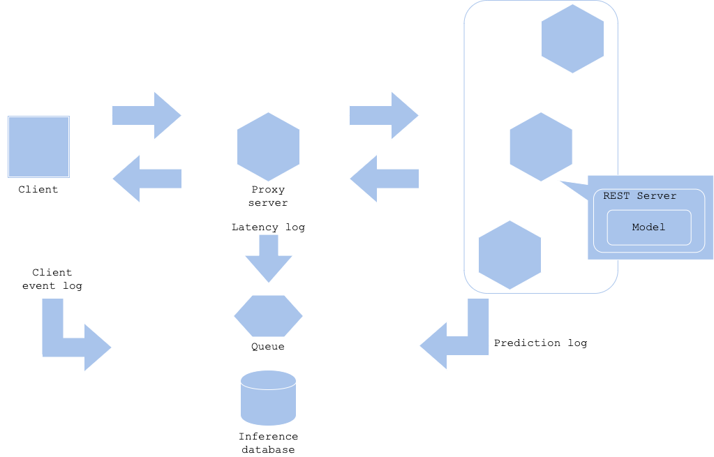

# Prediction log pattern

## Usecase
- 서비스 개선을 위해 추론, 지연 시간 등 각종 로그를 사용하고자 할 때. 
- 방대한 로그량에 DWH(data warehouse) 부하가 우려될 때. 
- 로그를 사용하여 모니터링 및 알림을 보내고 싶을 때. 

## Architecture
서비스 개선을 위해 로그를 수집하고 분석하는 것은 필수입니다. 입력, 지연 시간, 클라이언트 이벤트 및 관련 활동과 함께 추론 결과를 로그로 수집합니다. 로그들은 각각의 시스템 구성 내에서 생성되지만, 하나의 DWH에 통합 관리하는 것이 효율적입니다. 큐 방식을 사용하면 로그 집계시 DWH의 부하를 줄일 수 있습니다. 하지만 큐 처리 시간이 길어지게 되면 DHW 로그의 신선도(freshness)에 영향을 미칠 수 있습니다. 
로그는 분석 이외에도 많은 면에서 유용합니다. 예를 들어, 추론이나 클라이언트 로그가 예상과 다르거나 과거의 패턴과 확연히 달라졌다면, 워크 프로우에 이상이 생겼음을 예측할 수 있습니다. 이러한 경우 경고 알림을 보내 이상 현상을 분석하고 해결해야 합니다.클라이언트 코드의 변경으로 인해 입력 데이터 형식이 변경되는 경우도 있습니다. 만약 그 변화로 시스템 장애가 난다면 차라리 운이 좋은 경우입니다. 모델 서빙에서 장애 없이 잘못된 추론으로 잘못된 결과를 만들어 낼 수도 있습니다.그러한 경우를 대비하여 추론 시스템 로그뿐만 아니라 클라이언트 로그에 대해서도 이상 상태를 정의하고 알림 대상으로 해 두는 것이 중요합니다.

## Diagram

## Pros
- 추론 효과 분석 가능. 
- 경고 알람. 

## Cons
- 로그 양에 따라 비용이 증가할 수 있습니다. 

## Needs consideration
- 로그 수집 빈도와 로그 레벨
- 저장 빈도와 백업.
- 분석의 목적. 